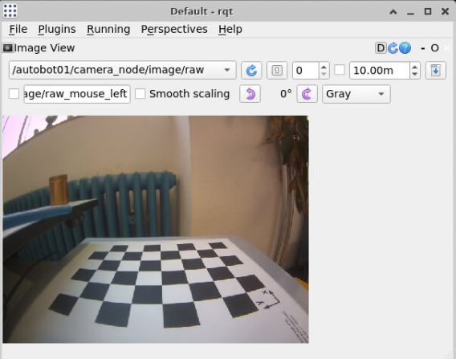
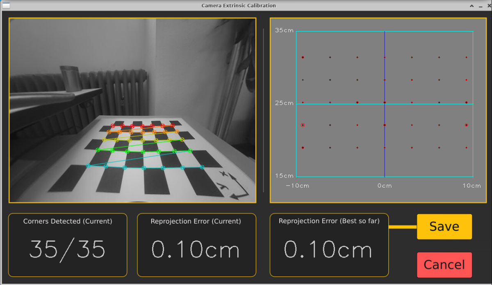
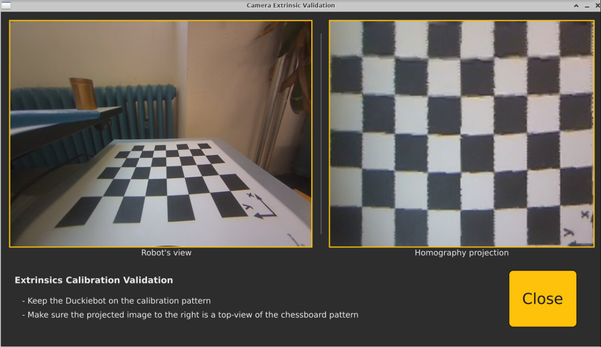

# Camera intrinsic and extrinsic calibration tools

This README describes how **camera calibration** can be performed on the Duckiebot, in the `main-workspace` setup (from [vnc-docker](https://github.com/ETHZ-DT-Class/vnc-docker)).

(The tools and procedures have been adapted from [the official Duckietown camera calibration](https://docs.duckietown.com/daffy/opmanual-duckiebot/operations/calibration_camera/index.html) documentation and code.)

## Prerequisites
***All terminal commands*** in this README are issued from the `main-workspace` (so on the Duckiebot, within the `main-workspace` Docker container). Since there will be graphical apps, it's recommended you connect to your robot's remote desktop **via VNC** and run the commands in there.

1. Clone this repository on your robot

    ```
    cd /code/catkin_ws/src/user_code
    git clone https://github.com/ETHZ-DT-Class/camera-calibration-tools.git
    ```

1. Prepare the python dependencies

    ```
    # a. navigate to the repo cloned just now
    cd camera-calibration-tools/

    # b. install libs needed
    pip install -U pip
    pip install --no-deps "lib-dt-computer-vision==0.1.8"
    ```

1. Prepare apt / ROS dependencies

    ```
    # ROS package for intrinsic calibration
    apt update && apt install -y ros-noetic-camera-calibration
    ```

## How-to: Intrinsic calibration

To estimate the intrinsic parameters.

### Start the calibration program
1. Run the `decoder_node` script from cloned repo

    ```
    # navigate in the cloned repo and run a script
    cd /code/catkin_ws/src/user_code/camera-calibration-tools/
    python3 decoder_node.py

    # this should be left running during INTRINSIC calibration

    # >>> Expected Log
    # [decoder_node] Received first image on: /YOUR_ROBOT_HOSTNAME/camera_node/image/compressed
    ```

1. Verify the decoded stream with `rqt` -> `Plugins` -> `Visualization` -> `Image View`
    * select topic: `/YOUR_ROBOT_HOSTNAME/camera_node_raw`
    * you should see the live camera view with REDUCED frequency (~2HZ)

    

1. In another terminal in VNC, start the calibration program

    ```
    # reload ROS environment to ensure newly installed packages are found
    source /opt/ros/noetic/setup.bash

    # start the calibration program (3 lines as the same command)
    rosrun camera_calibration cameracalibrator.py --size 7x5 --square 0.031 \
        image:=/$VEHICLE_NAME/camera_node/image/raw  \
        camera:=/$VEHICLE_NAME/camera_node
    ```

    The size are the number of inner corners on the calibration pattern (`7 by 5` with ours), and the square is the size in meter of the actual square side (`31mm` with ours). It is possible to generate other configuration of calibration patterns, too.

**Expected outcome**

In the VNC remote desktop, there should be a window that popped up, with a preview of your robot's camera stream (at a reduced update frequency). Please **maximize** this window.

Read the next section before you start using the calibration pattern!

### Adjust the focal length

* You can adjust the focal length of the camera by turning the black ring on the front of the camera.

    

* **Before** proceeding with the calibration, make sure to adjust the focal length as reasonable (for what the robot needs to drive on the ground)

***IMPORTANT NOTE***: since the focal length parameter is also calibrated, if your lens is touched after the calibration, you should do a new round of calibration!

### Move the calibration pattern and calibrate
Information
* There are 4 axes on the right of the calibration GUI app, indicating how well covered the data collected is. We aim to
  * be almost full, on `X`, `Y`, `Skew` axes, and
  * cover at least 60% on the `Size` axis

Actions:
1. The calibration pattern has to be attached to a **RIGID and FLAT** plane
1. You're suggested to move the calibration pattern in the following manners:
    * towards different borders of the field of view (X, Y axes)
    * show the pattern with different flatness angles (Skew)
    * use different distances to the camera (Size)

1. Once the criteria match as described above, you can click the "Calibrate" button.
    * The camera stream would freeze. You should check the Terminal that launched the calibrator for the progress.

        ```
        **** Calibating ****
        mono pinhole calibration...
        
        (wait for a few minutes)
        D = [...
        K = [...
        ```

    * When you see the calibrated matrices being printed in the terminal, try to move the calibration GUI window a little bit with mouse. The stream should already be active again.
    * Now put the calibration pattern in front of the camera again, and you should see the pattern looks more like straight, parallel lines.

#### Illustration images
* During calibration

  

* After hitting the "Calibrate" button. **DO NOT** commit just yet!

  

### Commiting the calibration results

**DO NOT** click yet the "Save" or "Commit" buttons just yet. We take a look how we can be sure the new parameters are saved.

To verify the new parameters, BEFORE committing the calibration
* navigate to `/data/config/calibrations/camera_intrinsic` folder on your robot
* list what files are there (`ls`) and typically there should be only 1 `default.yaml` file
* (optional: if there’s a `YOUR_ROBOT_HOSTNAME.yaml` file, rename it, e.g. to `prev_YOUR_ROBOT_HOSTNAME.yaml`)
* then click the **"Commit"** button (***!!! NOT*** "Save")
* and you should see a new file being created in the `/data/config/calibrations/camera_intrinsic` folder, named `YOUR_ROBOT_HOSTNAME.yaml`.

### Making sure the new calibration parameters are published in ROS

You can verify the existing camera parameters published in ROS by:

```
rostopic echo /$VEHICLE_NAME/camera_node/camera_info
```

Note that these are probably different from the values that were saved to `/data/config/calibrations/camera_intrinsic/YOUR_ROBOT_HOSTNAME.yaml`. So you will need to **reboot** your robot.

After the reboot, check the published camera parameters should now correspond to the values in the saved yaml file.

---

You have successfully calibrated your camera intrinsic parameters! You should stop the `decoder_node.py` script now if it's still running.

## How-to: Extrinsic calibration

To estimate homography matrix for the ground plane.

**NOTE**: you must perform the intrinsic calibration and ensure the new parameters are being published in ROS (see previous section) before the extrinsic calibration.

### Robot placement

Before the software is run, the robot has to be placed on the calibration pattern (and the calibration pattern should already be fixed on a hard flat surface from intrinsic calibration).

The following images (from official documentation), shows:
* the placement of the robot, with
    * wheel axis above the `y` axis
    * wheels bounded by the 2 black lines on `y` axis
    * camera on positive `x` axis

    

* and a sample view of the robot (might be slightly different depending on robot model) 
    * with a more-or-less clear background

    

After being properly placed, no movement is needed during the calibration.

### Running the calibration and validation

1. Start the calibration on your robot

    ```
    # navigate to the tools
    cd /code/catkin_ws/src/user_code/calibration_tools

    # run the program
    python3 run_camera_extrinsic_calibration.py 

    # >>> Expected logs
    # [INFO] [1729165903.038255]: Camera info message received. Unsubscribing from camera_info topic.
    # Board detected, overall error: 0.0010m +/- 0.0005m
    # ...
    ```

1. The following GUI should be displayed in the VNC remote desktop of your robot

    

1. Once you checked the robot-board placement is reasonable, and the reprojection error is under 0.0015m, you can click the "Save" button and take a picture of the terminal logs (see example below). The homography matrix data is to be verified with the saved file later.

    ```
    # >>> Example terminal logs (DO NOT RUN these)

    Extrinsics calibration:
    -----------------------

    homography:
    - (some numbers)
    - ...

    -----------------------

    Starting to initialize validator... (can take up to a minute)
    ```

1. Then wait for about 1 minute for the "validator" window to show up. (In terminal it should also print `Validator initialized successfully.`) You should see a reasonable top-down view of the checkerboard.

    

1. If the validation is sensible, you can "Close" the window. And finally we verify the saved parameters accord to this calibration process (the terminal logs that you took a picture of).

    ```
    cat /data/config/calibrations/camera_extrinsic/$VEHICLE_NAME.yaml 

    # >>> Expected output 
    # homography:
    # - (some numbers)
    # - ...

    # You should compare and make sure they match
    ```

---

You have now successfully completed the camera extrinsic calibration.